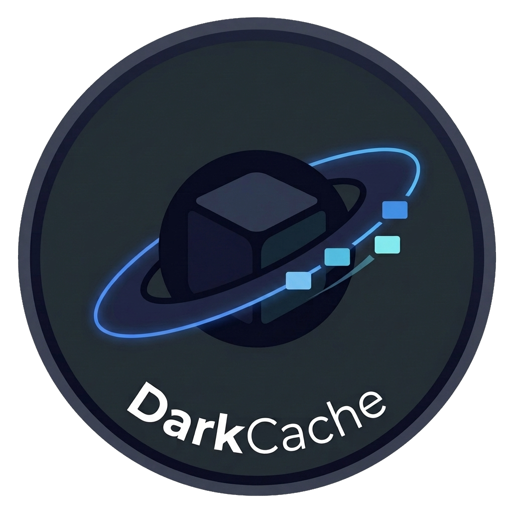

<div align="center">

# DarkCache



</div>


**DarkCache** is an atomic Fedora-based desktop image built with BlueBuild, designed for users who want a fast, modern, and highly customized **KDE Plasma** experience.

Built on Fedora Atomic technologies and powered by the **CachyOS kernel**, DarkCache combines performance-focused optimizations, useful desktop enhancements, curated packages, and a polished Plasma environment out of the box.

## Variants

### darkcache-desktop

Designed for desktops, gaming systems, and workstations using AMD or Intel graphics.

- CachyOS kernel and performance optimizations
- KDE Plasma with custom themes and desktop enhancements
- Native Steam installation
- Additional quality-of-life applications and utilities
- Suitable for AMD and Intel graphics systems

### darkcache-desktop-nvidia

Designed for desktops, gaming systems, and workstations using NVIDIA graphics.

- NVIDIA drivers built for the CachyOS kernel
- NVIDIA kernel modules signed for Secure Boot
- CachyOS kernel and performance optimizations
- KDE Plasma with custom themes and desktop enhancements
- Steam installed as a Flatpak to avoid host-level NVIDIA multilib conflicts
- NVIDIA Container Toolkit integration
- Additional quality-of-life applications and utilities

### darkcache-laptop

Optimized for laptops and portable devices.

- Uses the `scx_bpfland` scheduler in power-saving mode by default
- Improved battery life and responsiveness
- Better suspend and docked-device behavior
- CachyOS kernel and performance optimizations
- Native Steam installation
- Same KDE Plasma experience with laptop-specific tuning

## What's Included

DarkCache provides a curated desktop experience instead of a completely minimal setup. The goal is to deliver a polished Plasma environment that's ready for daily use immediately after installation.

### Added Packages

DarkCache includes additional software and enhancements such as:

- KDE Plasma Desktop
- CachyOS Kernel
- NVIDIA Drivers (desktop variant)
- Distrobox
- Fastfetch
- KDE Connect
- Flatpak Support
- Flathub Integration
- Additional Hardware Support Packages
- Performance Tuning Utilities
- Plasma Themes
- Custom Icon Themes
- Custom Cursor Themes
- Custom SDDM Theme
- Additional KDE Utilities and Enhancements

### Removed Packages

To keep the image focused and reduce unnecessary clutter, several default packages are removed:

- Toolbox
- Unnecessary GNOME applications
- GNOME-specific desktop components
- Redundant utilities already replaced by better alternatives
- Other packages not relevant to a KDE Plasma workflow

### Desktop Customizations

DarkCache comes preconfigured with:

- Custom Plasma theme
- Custom icon theme
- Custom cursor theme
- Custom SDDM login theme
- Improved panel layout
- Sensible KDE defaults
- Performance-oriented system tuning
- NVIDIA support on desktop images
- Laptop-focused power management on laptop images

## Philosophy

DarkCache aims to deliver a complete KDE Plasma experience while preserving the reliability and simplicity of Fedora Atomic desktops.

Unlike minimal Atomic images, DarkCache ships with a carefully selected collection of applications, themes, and customizations so users can start working, gaming, or developing immediately without spending hours setting up their environment.

## Installation

1. Disable **Secure Boot** in your BIOS/UEFI.
2. Boot into a Fedora Atomic-based distribution.
3. Switch to the latest DarkCache image:

```bash
bootc switch ghcr.io/sn0whax/darkcache-desktop:latest
```

4. Reboot your system:

```bash
systemctl reboot
```

5. If prompted, enroll the MOK key during boot.
6. Re-enable Secure Boot if desired.

## Updates

The `latest` tag always points to the newest DarkCache build.

DarkCache follows the Fedora release version defined in its build recipe, ensuring you won't be unexpectedly upgraded to a new Fedora major release without explicitly choosing to do so.

## Verification

DarkCache images are signed using **Sigstore Cosign**.

To verify an image signature, download the `cosign.pub` key from this repository and run:

```bash
cosign verify --key cosign.pub ghcr.io/sn0whax/darkcache-desktop
```

## Why DarkCache?

- KDE Plasma-first experience
- CachyOS performance enhancements
- NVIDIA-ready desktop images
- Atomic reliability powered by BlueBuild
- Beautiful themes and visual customization
- Curated package selection without unnecessary bloat
- Built for gaming, development, and everyday use
- Distrobox-first workflow
- Sensible defaults with room for customization

---

**DarkCache brings together Fedora Atomic stability, CachyOS performance, and a polished KDE Plasma experience in a single image.**
